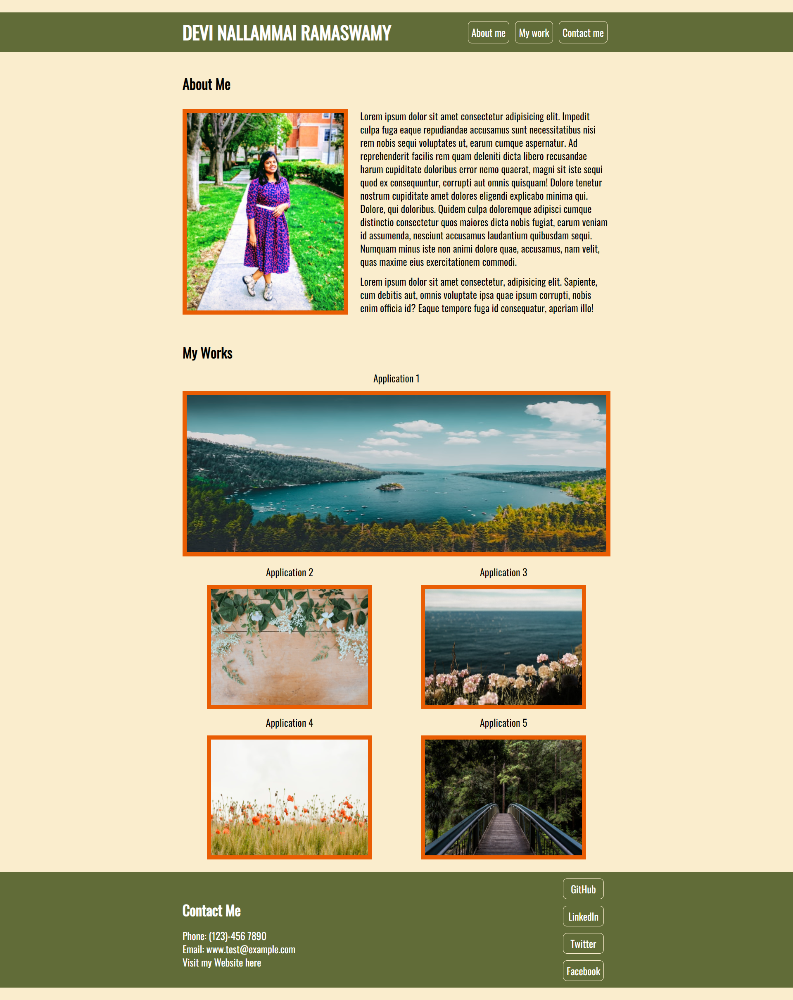
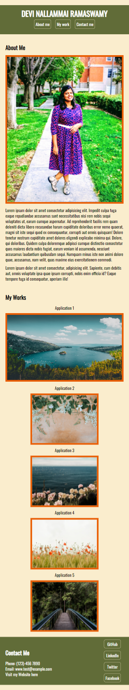
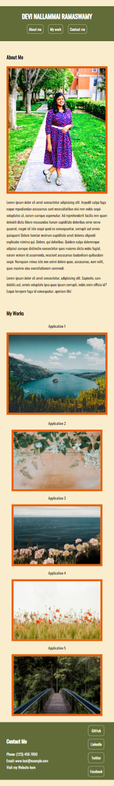

# Module 2 Challenge - Homework2

## Table of contents

- [Overview](#overview)
  - [The challenge](#the-challenge)
  - [User Story](#user-story)
  - [Acceptance Criteria](#acceptance-criteria)
  - [Screenshot](#screenshot)
  - [Links](#links)
- [My process](#my-process)
  - [Built with](#built-with)
  - [What I learned](#what-i-learned)
 
## Overview

A portfolio of work can showcase your skills and talents to employers looking to fill a part-time or full-time position. An effective portfolio highlights your strongest work as well as the thought processes behind it. Students who have portfolios with deployed web applications (meaning they are live on the web) are typically very successful in their career search after the boot camp. This last point can't be stressed enough: having several deployed projects is a minimum requirement to receive an initial interview at many companies.

### The challenge

With these points in mind, in this Challenge you'll set yourself up for future success by applying the core skills you've recently learned: flexbox, media queries, and CSS variables. You'll get to practice your new skills while creating something that you'll use during your job search. It's a win-win that you'll likely be grateful for in the future!

### User Story

```
AS AN employer
I WANT to view a potential employee's deployed portfolio of work samples
SO THAT I can review samples of their work and assess whether they're a good candidate for an open position
```

### Acceptance Criteria

```
GIVEN I need to sample a potential employee's previous work
WHEN I load their portfolio
THEN I am presented with the developer's name, a recent photo or avatar, and links to sections about them, their work, and how to contact them
WHEN I click one of the links in the navigation
THEN the UI scrolls to the corresponding section
WHEN I click on the link to the section about their work
THEN the UI scrolls to a section with titled images of the developer's applications
WHEN I am presented with the developer's first application
THEN that application's image should be larger in size than the others
WHEN I click on the images of the applications
THEN I am taken to that deployed application
WHEN I resize the page or view the site on various screens and devices
THEN I am presented with a responsive layout that adapts to my viewport
```

### Screenshot
**Normal screen size**

**Tablet screen size**

**Smartphone screen size**



### Links

- Github Repository URL: [Github Repository](https://github.com/rmdn321/homework-2)
- Github Pages URL: [Github Pages](https://rmdn321.github.io/homework-2/)

## My process

### Built with

- Semantic HTML5 markup
- CSS

### What I learned

- Implement basic media queries for screens.

- Implement a CSS grid to accomplish a complex layout.

- Implement a flexbox layout for a responsive web design.

- Use flexbox justification and alignment properties for spacing.

- Add pseudo-classes and pseudo-elements to HTML elements.

- Use CSS selectors to reference HTML elements in different ways.

- Use CSS variables to keep your code clean.


